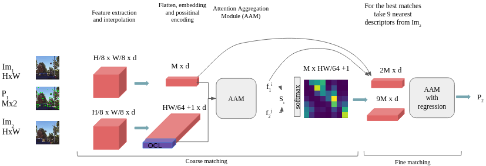
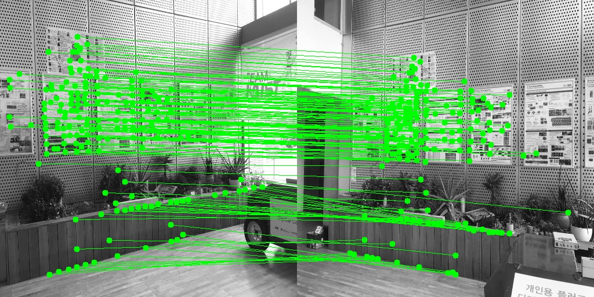
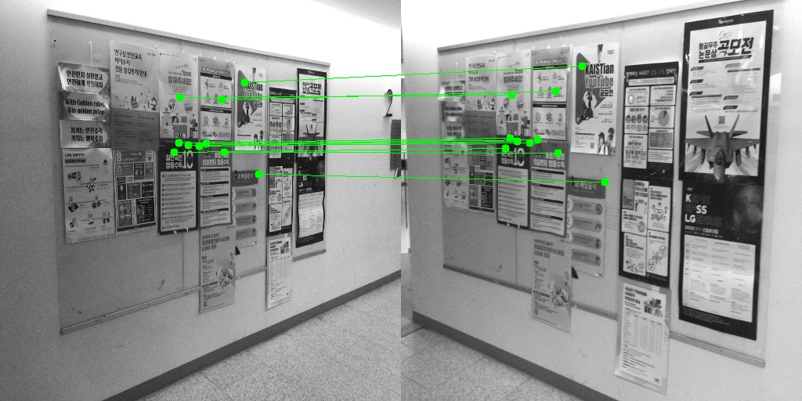

# Keypoints Tracking via Transformer Networks

Model for sparse keypoints tracking across images using transformer networks

Our approach is hierarchical since a coarse keypoint tracking is accurately refined by a second transformer network. The model can be be used for both: image matching, and keypoint tracking 

## Architecture

## Demo

### Image matching 

Match two image using [SuperPoint](https://github.com/magicleap/SuperPointPretrainedNetwork) descriptors 
(Basically tracking keypoints extracted by SuperPoint  ) 

- python demo_2_im.py --image1_path=path1 --image2_path=path2
- python demo_2_im.py                                          if you want to save the result\

For example : 

python demo_2_im.py --image1_path ="./media/im1.jpg" --image2_path="./media/im2.jpg"

 ### Point Tracking

Tracking the points specified in demo_point_tracking.py. 
 
- python demo_point_tracking.py --image1_path=path1 --image2_path=path2

 
 

## Comparing with [SuperGlue](https://github.com/magicleap/SuperGluePretrainedNetwork)

Since there are no analogous works, we provide a comparison with the state-of-the-art method for keypoint feature matching SuperGlue. We tested our model on 2 datasets: COCO2014, and HPatches under different levels of  light intensity, and projective transforms. For the evaluation metrics we selected 1) matching accuracy: the match is correct if distance between predicted and real position of the point is less than 6 pixels, and 2) number of correctly matched keypoints.

| Results for acc. | SuperGlue accuracy | Our model accuracy, only coarse module | Our model accuracy with fine module |
| :--- | :--- | :--- | :--- |
| COCO test easy homographies | 94.8% | 93.5% | 95.3% |
| COCO test hard homographies | 91.6% | 90.2% | 91.7% |
| COCO test hard homographies  + illumination changes| 89.0% | 87.2% | 88.8% |
| Hpatches hard homographies | 91.4% | 90.5% | 91.5% |

| Results for number of correctly  matched  point | SuperGlue, number of correctly  matched  points out of 512 | Our model, number of correctly matched points out of 512 |
| :--- | :--- | :--- |
| COCO test easy homographies | 249 | 358 | 
| COCO test hard homographies | 240 | 346 |
| COCO test hard homographies  + illumination changes | 195 | 300 |
| Hpatches hard homographies | 222 | 340| 

